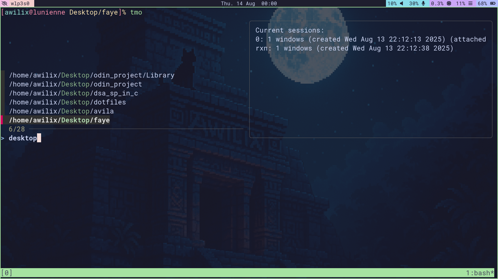

# ⚙️ dotfiles 

> An uninteresting laptop setup managed with GNU Stow 



## ✨ Overview

This repo contains my personal dotfiles — configs for shells, editors, and other
tools I use a lot.

> ⚠️ If it works on my machine, it might work on yours; no promises, though.

## 📦 Dependencies

Install `git` and `stow` using your package manager

```zsh
% doas pacman -S --needed git stow
```

*I'll add the native and foreign packages eventually*

## 🚀 Installation

Clone the repository

```zsh
% git clone https://github.com/awilix-23/dotfiles.git
```

Navigate into the directory and symlink the config files

```zsh
% cd dotfiles
% stow -t ~ .
```
